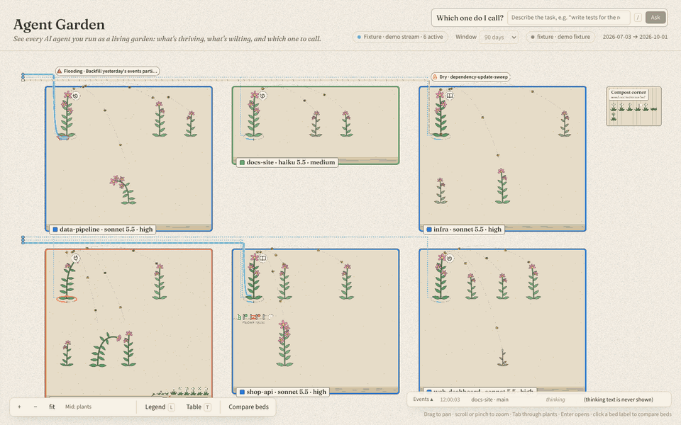
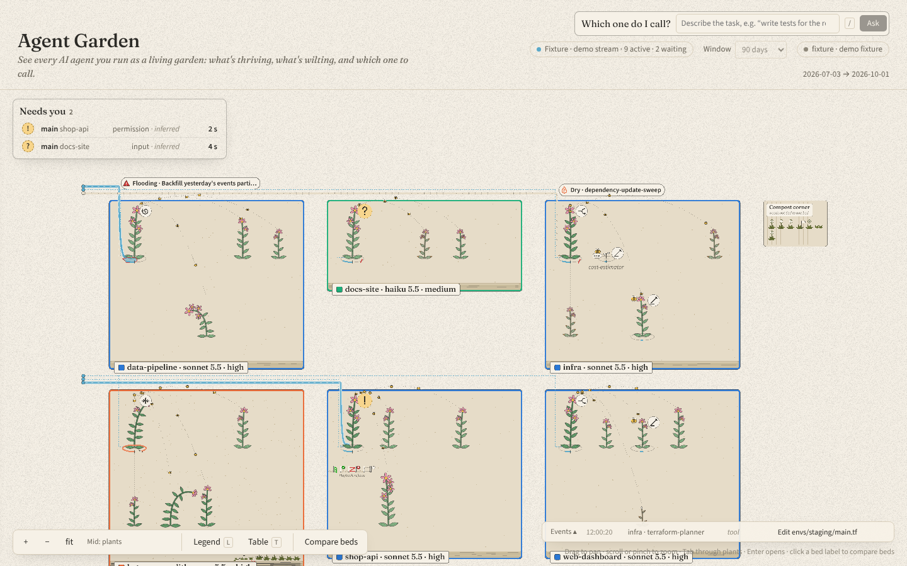
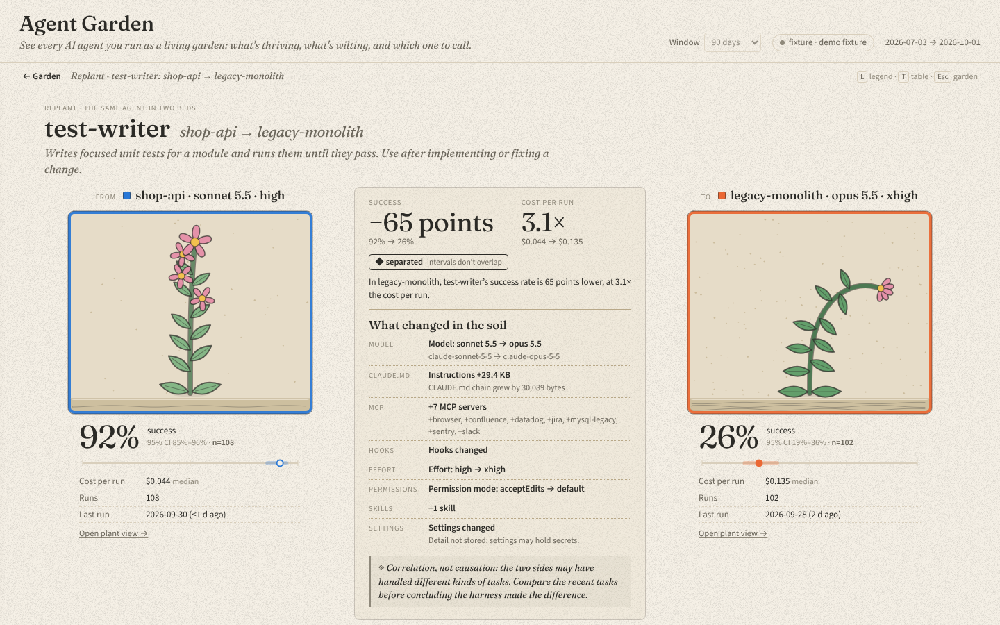
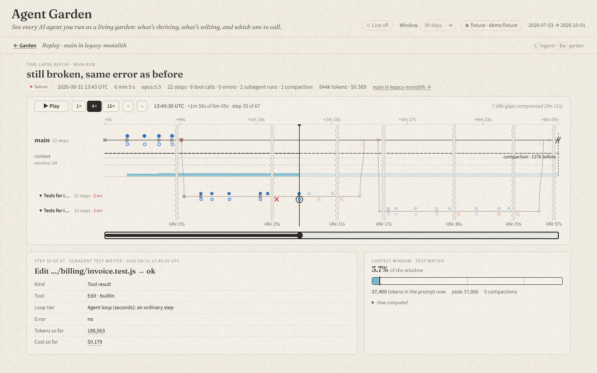
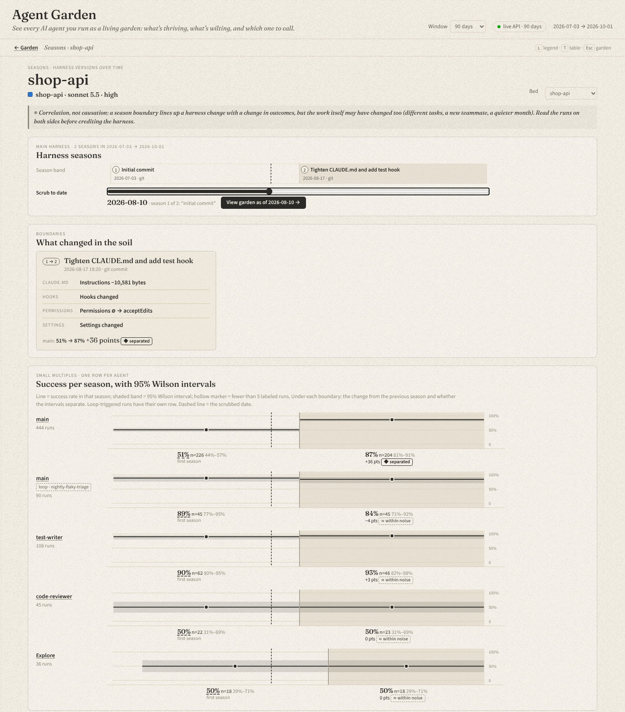
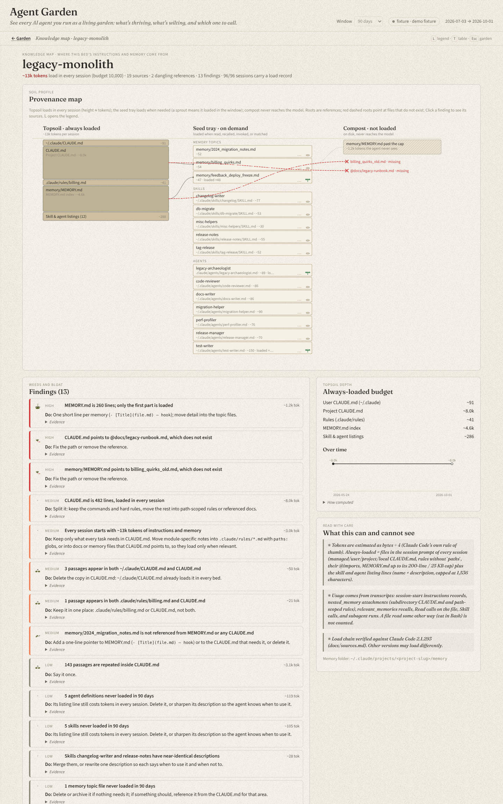
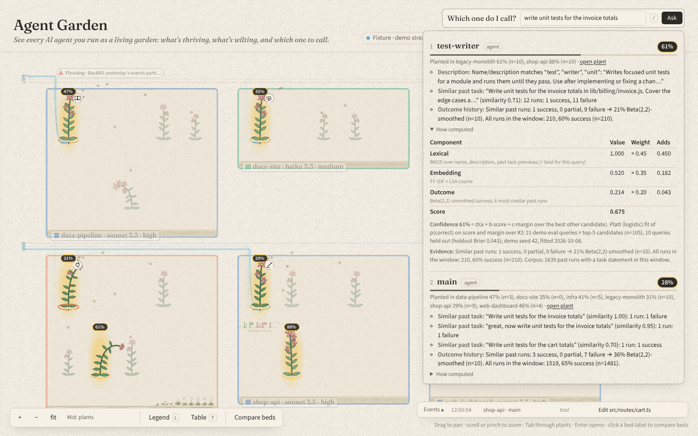

# Agent Garden

See every AI agent you run as a living garden: what's thriving, what's wilting, and which one to call.

Agent Garden reads your local Claude Code data (transcripts, `agents/*.md`, skills, settings,
CLAUDE.md files, git history), redacts it, stores it in a local SQLite file, and draws it as a garden.
Each project is a bed, and each agent working in it is a plant. Every visual property encodes a metric
you can act on, and the legend (`L`) tells you which one.



## What you see

| | |
|---|---|
|  | **Garden.** Height = runs, blooms = success rate, droop = recent failure share, foliage = median cost per run, bed edging + label = model. Live rings and marks show which agents are working now. "Needs you" lists the agents waiting on you. |
|  | **Plant, compare, and replant.** The same `test-writer` agent succeeds 92% of the time in one project and 26% in another. The page shows the harness difference behind that gap and whether the intervals separate. |
|  | **Replay.** One run on a timeline: tool calls, errors, subagent lanes, compaction, and context fill against the window. |
|  | **Seasons.** Success per harness version, with 95% Wilson intervals, the diff at each boundary, and a scrubber that shows the garden as of a past date. |
|  | **Knowledge map.** Where a bed's instructions and memory come from, what loads in every session (tokens), and bloat checks: dangling imports, orphan memory files, MEMORY.md past its cap. |
|  | **"Which one do I call?"** Type a task. The router ranks agents and skills by their descriptions, similar past tasks, and how those tasks turned out, with a calibrated confidence for each bed. |

All screenshots use the synthetic demo dataset.

## Setup

Requires Node ≥ 22.22 and pnpm 10.

```
git clone https://github.com/lamgs/agent-garden && cd agent-garden
pnpm install
pnpm demo                 # → http://127.0.0.1:4310
# your own data:  pnpm garden ingest && pnpm garden serve
```

`pnpm demo` builds the web app, generates a deterministic demo dataset (6 projects, 90 days, 2,041
runs) into `.garden-demo/`, ingests it through the same path as real data, and serves it with a
replayed live stream. Stop it with Ctrl+C before serving your own data on the same port.

**Your own data.** `pnpm garden ingest` reads `~/.claude` (transcripts, agents, skills, settings,
memory) and the MCP server names in `~/.claude.json`, and writes `~/.agent-garden/garden.db`.
`pnpm garden serve` serves that store at http://127.0.0.1:4310 and tails your transcripts for the
live layer. Run `pnpm garden inspect` first if you want to see what the parser finds (shapes and
counts, never content). Ingestion is incremental, so run `ingest` again whenever you want fresh
numbers. `serve` needs the web build: `pnpm demo` makes it, or run `pnpm build`.

Claude Code deletes transcripts older than `cleanupPeriodDays` (default 30) at startup. The garden
keeps what it has ingested, but anything deleted before your first ingest is gone. To keep more
history, raise `cleanupPeriodDays` in `~/.claude/settings.json` and ingest regularly.

## Vocabulary

- **Agent**: a model using tools in a reason, act, observe cycle toward a goal. In Claude Code data,
  the main thread (`main`) or a subagent type (`Explore`, a custom `agents/*.md` definition).
- **Harness**: the environment one agent runs inside: CLAUDE.md, allowed tools, permissions, MCP
  servers, skills, model, effort. Harnesses are versioned. A project's lineage of versions is a
  **bed**, and each version is a **season**.
- **Skill**: packaged know-how for one task, loaded on demand (`SKILL.md`).
- **Playbook**: skills chained into required steps with gates, declared in `garden.yaml`.
- **Loop**: what triggers agents, checks their work, and decides what runs next (hooks, cron,
  recurring headless runs). Tiers: `agent` (seconds), `verification` (minutes), `application`
  (hours), `hill_climbing` (days).
- **Run**: one agent pursuing one goal. Main thread: one human prompt plus all work until the next
  human prompt. Subagent: one invocation.
- **Planting**: one agent in one bed (a plant).

## Privacy

- Everything runs on your machine. No telemetry, no remote APIs, no CDN assets (fonts are bundled).
  A build test fails if the web bundle contains an external URL.
- The server binds to `127.0.0.1` only. It rejects requests addressed to any other `Host` (DNS
  rebinding), and writes need a loopback `Origin` plus `application/json` (CSRF). See
  [docs/api.md](docs/api.md).
- Redaction happens at ingestion, before anything reaches the store. The store accepts only text
  that went through the redactor (a branded type, enforced by lint). Values under `env`, `headers`,
  and similar config maps are replaced; hook commands and CLAUDE.md contents are stored as hashes
  and sizes only. Message and tool text is kept as redacted previews of at most 2,000 characters.
- `pnpm test` includes a proof test: secrets of 20 kinds are planted in every free-text field, and
  none of them (or any 12-character fragment) may appear in the raw bytes of the SQLite files.
- The live layer reads transcripts you can already read, keeps its state in memory, and writes
  nothing. It changes no Claude Code settings and installs no hooks. Its previews pass the same
  redactor and are cut to 120 characters; thinking text is never shown.
- Dollar amounts are never stored. Cost is computed when you look, from tokens and a versioned
  pricing table ([packages/core/src/pricing.ts](packages/core/src/pricing.ts)).

## What the live layer knows and what it infers

Transcripts record what happened, not what the UI is waiting on. So:

- **Known** (read from the transcript lines): prompts, tool calls and results, errors, subagent
  starts and ends, compactions, the model, and context size per API call.
- **Inferred** (shown dashed and labeled "inferred", with the rule on hover): waiting for permission
  (a tool call with no result after 6 s, 30 s for Bash/web/MCP, a slow tool looks the same), waiting
  for input (a main turn ended), idle (no line for 5 minutes). Sessions whose recent calls were
  auto-approved are never marked as waiting for permission.

The rules are listed in [docs/api.md](docs/api.md#live-layer). Hooks would make these states exact,
but they require editing your settings, so they are not used.

## Honest metrics

- A run's outcome comes from explicit heuristics (tests passing after the last edit, the user
  retrying, errors at the end, and so on), versioned (`h1`) and listed with their weights in
  [docs/schema.md](docs/schema.md). Every rate links to which signals fired.
- Manual labels win over heuristics (`garden label`, or the buttons in the plant view), and the UI
  says when a label is manual.
- Rates show `n=` and a 95% Wilson interval. Comparisons say "separated" only when the intervals do
  not overlap; otherwise "within noise".
- Seasons and bed comparisons are correlation, not causation, and the pages say so.
- Token usage is deduped by API message id (Claude Code repeats `usage` on every line of a
  response). Costs that include estimated tokens are labeled.

## CLI

`pnpm garden <command>`. Defaults: data in `~/.agent-garden` (or `$GARDEN_HOME`), Claude Code data
in `~/.claude`.

| Command | What it does |
|---|---|
| `inspect` | Census of your Claude Code data: record types, versions, unknown shapes, warnings. Never prints content |
| `ingest [--full]` | Read, redact, and store; incremental by file size and mtime (`--full` re-parses everything) |
| `label <runId> <success\|partial\|failure\|unknown\|clear> [--note "..."]` | Manual outcome label (survives re-ingestion) |
| `stats` | Row counts and the outcome mix in the store |
| `serve [--port 4310] [--as-of <ISO>] [--no-live] [--live-demo]` | Serve the garden on 127.0.0.1. The live layer is on by default (tails `~/.claude/projects`); `--no-live` turns it off; `--live-demo` replays stored runs instead |
| `export --out <dir>` | Static site of the garden view (no API; other pages need `serve`) |
| `db:init` | Create or migrate the store |
| `live:probe [--seconds 20]` | Tail transcripts and print event shapes and latency, never content |

Common options: `--data <dir>`, `--db <file>`, `--claude-home <dir>`, `--claude-json <file>`,
`--garden-yaml <file>`. Other scripts: `pnpm router:eval` (router evaluation table),
`pnpm check:fresh` (clone at HEAD into a temp dir, run the setup commands, check the garden
renders), `pnpm readme:gif` (re-record the GIF above).

## Development

```
pnpm typecheck
pnpm lint
pnpm test        # unit, golden, and redaction-proof tests
pnpm build
pnpm e2e         # Playwright; writes docs/screenshots (E2E_PORT to change the port)
```

## Repo layout

```
packages/core     schema types, view contracts, encodings registry, pricing, heuristics, stats
packages/ingest   Claude Code adapter, redaction, SQLite store, live tailer, `garden` CLI
packages/router   "which one do I call?" ranking (BM25 + TF-IDF/LSA + outcome kNN)
packages/server   local Hono API on 127.0.0.1, view builders, static export
apps/web          React shell; PixiJS garden renderer in apps/web/src/garden
scripts/demo      deterministic demo-dataset generator (writes real Claude Code file formats)
fixtures/         small synthetic fixtures for parser and redaction tests
docs/             PRD, schema, API, sources, design, demo script, research
```

## Docs

- [docs/PRD.md](docs/PRD.md): problem, users, scope, non-goals, open questions
- [docs/demo-script.md](docs/demo-script.md): a 4-minute walkthrough of `pnpm demo`
- [docs/schema.md](docs/schema.md): trace schema and SQLite tables
- [docs/api.md](docs/api.md): local API, guards, live stream
- [docs/sources.md](docs/sources.md): every verified fact about Claude Code's file formats, with where it was verified
- [docs/design.md](docs/design.md): palette and visual encoding decisions
- [PLAN.md](PLAN.md) and [PROGRESS.md](PROGRESS.md): plan and status log
